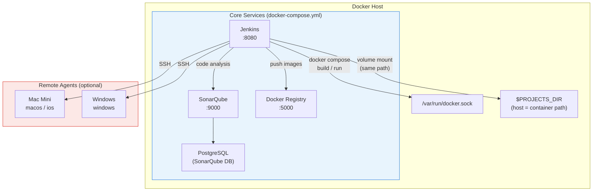
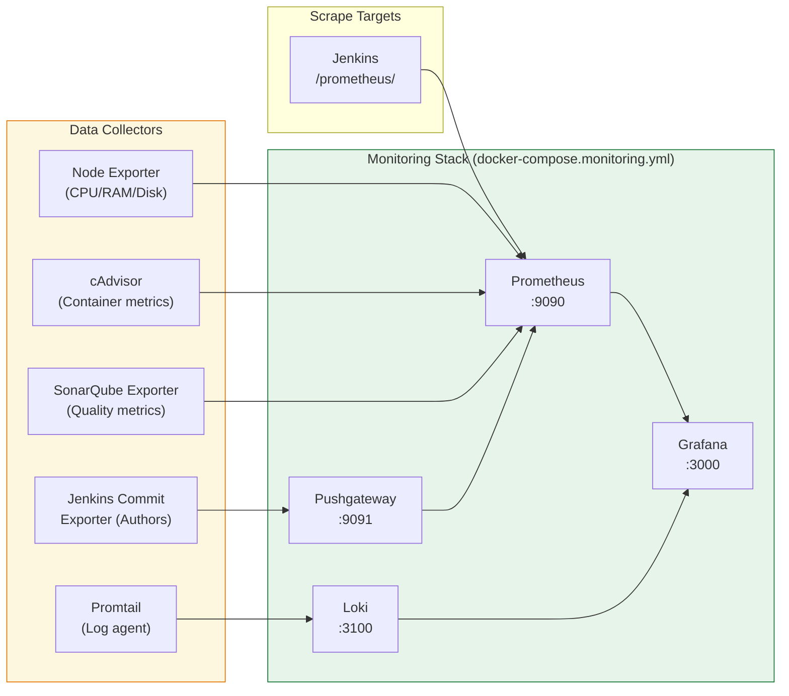
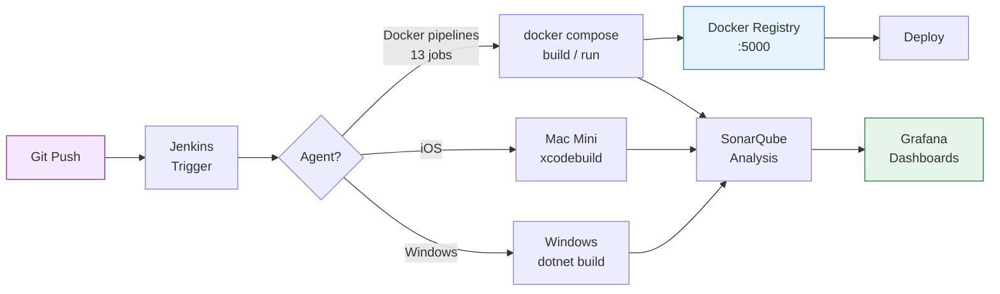
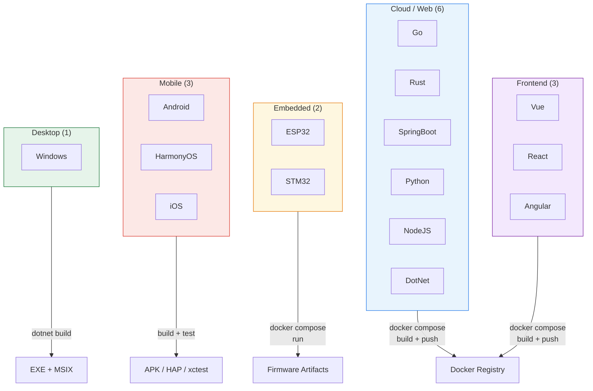
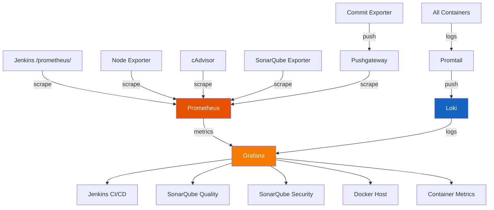

# Jenkins DevOps Starter Kit

[](#architecture-evaluation)


-success?style=flat-square)
-blueviolet?style=flat-square)


Production-tested Jenkins CI/CD environment with 15 pre-built pipelines, SonarQube code analysis, Docker Registry, and a full monitoring stack (Prometheus + Grafana + Loki). One command to deploy.

**15 pipelines tested and verified** across Go, Rust, Vue, .NET, Spring Boot, Python/Flask, Node.js/Express, React, Angular, ESP32, STM32, Android, HarmonyOS, iOS, and Windows — covering web, cloud, embedded, and mobile platforms.

---

## Table of Contents

- [Quick Start](#quick-start)
- [Architecture](#architecture)
- [Architecture Evaluation](#architecture-evaluation)
- [Pipelines](#pipelines)
- [Monitoring Dashboards](#monitoring-dashboards)
- [Customization](#customization)
- [Environment Variables](#environment-variables)
- [Troubleshooting](#troubleshooting)
- [Sample Project](#sample-project)
- [License](#license)

---

## Quick Start

### Prerequisites

- Docker Engine 24+
- Docker Compose v2

### 1. Clone and configure

```bash
git clone https://github.com/anthropics/devops-starter-kit.git
cd devops-starter-kit
cp .env.example .env
```

Edit `.env` and set `PROJECTS_DIR` to the **absolute path** where your project repos are cloned:

```env
PROJECTS_DIR=/home/your-user/devops-projects
```

> **Why absolute?** Pipelines using `docker compose run` (ESP32, Android, HarmonyOS, .NET) create new containers with volume mounts. The Docker daemon resolves these paths on the **host**, so relative paths won't work. The directory is mounted into the Jenkins container at the same path, ensuring host and container paths match.

### 2. Start core services

```bash
docker compose up -d
```

Wait ~2 minutes for Jenkins to initialize, then:

| Service | URL | Credentials |
|---------|-----|-------------|
| Jenkins | http://localhost:8080 | admin / admin |
| SonarQube | http://localhost:9000 | admin / admin |
| Registry | http://localhost:5000/v2/_catalog | — |

### 3. (Optional) Start monitoring stack

```bash
docker compose -f docker-compose.yml -f docker-compose.monitoring.yml up -d
```

| Service | URL | Credentials |
|---------|-----|-------------|
| Grafana | http://localhost:3000 | admin / admin |
| Prometheus | http://localhost:9090 | — |
| Pushgateway | http://localhost:9091 | — |

---

## Architecture

### Core Services



### Monitoring Stack



### CI/CD Pipeline Flow



---

## Architecture Evaluation

### Overall Architecture Rating: **8.0/10** (Production-Ready)

| Category | Rating | Details |
|----------|--------|---------|
| **Reproducibility** | ⭐⭐⭐⭐⭐ 9/10 | JCasC + Groovy init + Docker Compose = fully declarative, one-command deploy |
| **Pipeline Coverage** | ⭐⭐⭐⭐⭐ 10/10 | 15 pipelines across 5 platforms (Web, Cloud, Embedded, Mobile, Desktop) |
| **Monitoring** | ⭐⭐⭐⭐⭐ 9/10 | Prometheus + Grafana + Loki + 5 dashboards + commit author tracking |
| **Cross-Platform** | ⭐⭐⭐⭐⭐ 9/10 | ARM64 native + QEMU x86 emulation, Mac/Windows remote agents via SSH |
| **Ease of Use** | ⭐⭐⭐⭐☆ 8/10 | One-command deploy, good docs; `PROJECTS_DIR` absolute path adds friction |
| **Maintainability** | ⭐⭐⭐⭐☆ 8/10 | All config as code with env vars; inline pipeline scripts (not Jenkinsfile) |
| **Modularity** | ⭐⭐⭐⭐☆ 8/10 | Monitoring stack fully optional; agent config via env vars |
| **Security** | ⭐⭐⭐☆☆ 5/10 | Docker socket passthrough, default credentials, no TLS |
| **Scalability** | ⭐⭐⭐☆☆ 5/10 | Single-node Jenkins, no HA/clustering, no K8s orchestration |

### Key Strengths

- ✅ **One-Command Deploy**: `docker compose up -d` brings up Jenkins + SonarQube + Registry with 15 pre-built pipelines
- ✅ **15 Production-Tested Pipelines**: All verified SUCCESS — Go, Rust, Vue, .NET, Spring Boot, Python, Node.js, React, Angular, ESP32, STM32, Android, HarmonyOS, iOS, Windows
- ✅ **Configuration as Code**: JCasC for Jenkins config, Groovy init for idempotent job creation, Docker Compose for infrastructure — no manual UI setup
- ✅ **Full Monitoring Stack**: Prometheus metrics + Grafana dashboards + Loki log aggregation, with commit author tracking via custom exporter
- ✅ **Multi-Architecture**: ARM64 native support, QEMU x86_64 emulation for Android/HarmonyOS, remote SSH agents for Mac/Windows
- ✅ **Desensitized & Portable**: Zero hardcoded IPs, paths, or credentials — all driven by `.env` and `jenkins/secrets/`
- ✅ **Modular Design**: Monitoring stack is a separate compose file, SSH agents are optional env vars

### Known Limitations

- ⚠️ **Docker Socket Passthrough**: Jenkins container mounts `/var/run/docker.sock` — container has full host Docker access (necessary for DinD builds, but a security trade-off)
- ⚠️ **Inline Pipeline Scripts**: Pipelines are embedded in job XML, not separate Jenkinsfile in each repo — harder to version per-project
- ⚠️ **Single-Node Jenkins**: No HA or controller/agent clustering — suitable for dev/staging, not production at scale
- ⚠️ **Default Credentials**: admin/admin for Jenkins, SonarQube, Grafana — must be changed for any non-local deployment
- ⚠️ **No TLS**: All services expose HTTP only — add a reverse proxy (nginx/Caddy) for HTTPS in production
- ⚠️ **PROJECTS_DIR Must Be Absolute**: Required for `docker compose run` volume mounts — relative paths silently break embedded/mobile pipelines
- ⚠️ **QEMU Emulation Overhead**: Android and HarmonyOS builds use x86_64 emulation on ARM64 hosts — slower than native

### Improvement Roadmap

| Priority | Improvement | Impact |
|----------|-------------|--------|
| High | Migrate inline scripts to Jenkinsfile per repo | Maintainability |
| High | Add TLS reverse proxy (Caddy/nginx) | Security |
| Medium | Implement Jenkins controller-agent separation | Scalability |
| Medium | Add backup/restore automation | Reliability |
| Low | Kubernetes deployment option | Scalability |
| Low | Vault integration for secrets | Security |

---

## Pipelines

All 15 pipelines are pre-loaded via Groovy init script on first boot:

| # | Pipeline | Type | Platform |
|---|----------|------|----------|
| 1 | go-app-pipeline | Docker compose build + push | Cloud / Web |
| 2 | rust-app-pipeline | Docker compose build + push | Cloud / Web |
| 3 | vue-app-pipeline | Docker compose build + push | Frontend |
| 4 | dotnet-app-pipeline | Docker compose build + push | Cloud / Web |
| 5 | springboot-app-pipeline | Docker compose build + push | Cloud / Web |
| 6 | python-app-pipeline | Docker compose build + push | Cloud / Web |
| 7 | node-app-pipeline | Docker compose build + push | Cloud / Web |
| 8 | react-app-pipeline | Docker compose build + push | Frontend |
| 9 | angular-app-pipeline | Docker compose build + push | Frontend |
| 10 | esp32-app-pipeline | Docker compose run (embedded) | Embedded |
| 11 | stm32-app-pipeline | Docker compose build | Embedded |
| 12 | android-app-pipeline | Docker compose build + run (amd64) | Mobile |
| 13 | harmonyos-app-pipeline | Docker compose build + run (amd64) | Mobile |
| 14 | ios-app | Swift build + test (Mac agent) | Mobile |
| 15 | windows-app-pipeline | dotnet build + test (Windows agent) | Desktop |

> **Note:** iOS and Windows pipelines require dedicated agents (Mac Mini / Windows machine). See [Adding SSH Agents](#adding-ssh-agents) below.

### Pipeline Architecture



---

## Monitoring Dashboards

Five pre-loaded Grafana dashboards in the **DevOps Starter Kit** folder:

| Dashboard | Description |
|-----------|-------------|
| **Jenkins CI/CD** | Build success rate, duration trends, pipeline comparison, commit author activity |
| **SonarQube Code Quality** | Bugs, code smells, coverage trends, LOC by language |
| **SonarQube Security** | Vulnerabilities, hotspots, security rating trends |
| **Docker Host** | CPU, memory, disk I/O, network (Node Exporter) |
| **Container Metrics** | Per-container CPU, memory, network I/O (cAdvisor) |

### Monitoring Data Flow



### SonarQube Token Setup

For SonarQube dashboards to display data:

1. Login to SonarQube (http://localhost:9000)
2. Go to **My Account** > **Security** > **Generate Token**
3. Add the token to `.env`:
   ```
   SONARQUBE_TOKEN=squ_xxxxxxxxxxxxxxxxxxxx
   ```
4. Restart the monitoring stack

---

## Customization

### Adding a New Pipeline

1. Create a Jenkins pipeline config XML (use any existing file in `jobs/` as a template)
2. Save it to `jobs/my-new-pipeline.xml`
3. Restart Jenkins — the Groovy init script will auto-create the job

### Changing the Docker Registry

Edit `.env`:
```env
DOCKER_REGISTRY=your-registry.example.com:5000
```

### Adding SSH Agents

For iOS (Mac) or Windows pipelines, configure SSH agents via `.env`:

1. Place the SSH private key files in `jenkins/secrets/`:
   - `jenkins/secrets/MACMINI_SSH_KEY` — for macOS/iOS agent
   - `jenkins/secrets/WINDOWS_SSH_KEY` — for Windows agent
2. Set the agent variables in `.env`:
   ```env
   MACMINI_HOST=10.0.0.10
   MACMINI_USER=jenkins
   MACMINI_REMOTE_FS=/Users/jenkins/agent
   WINDOWS_HOST=10.0.0.20
   WINDOWS_USER=jenkins
   WINDOWS_REMOTE_FS=C:\jenkins-agent
   ```
3. Restart Jenkins — JCasC will auto-configure the agents with labels `macos ios` and `windows`

---

## Environment Variables

| Variable | Default | Description |
|----------|---------|-------------|
| `PROJECTS_DIR` | *(required)* | **Absolute path** to project repos directory. Mounted into Jenkins at the same path so `docker compose run` volume mounts work correctly. |
| `JENKINS_ADMIN_PASSWORD` | `admin` | Jenkins admin password |
| `DOCKER_GID` | `999` | Docker group ID on host (run `getent group docker \| cut -d: -f3`) |
| `TZ` | `Asia/Taipei` | Timezone |
| `DOCKER_REGISTRY` | `localhost:5000` | Docker registry address |
| `SONAR_DB_USER` | `sonarqube` | SonarQube PostgreSQL user |
| `SONAR_DB_PASSWORD` | `sonarqube` | SonarQube PostgreSQL password |
| `GRAFANA_ADMIN_USER` | `admin` | Grafana admin user |
| `GRAFANA_ADMIN_PASSWORD` | `admin` | Grafana admin password |
| `SONARQUBE_TOKEN` | *(empty)* | SonarQube API token for exporter |
| `MACMINI_HOST` | *(empty)* | Mac Mini SSH agent IP (optional) |
| `MACMINI_USER` | *(empty)* | Mac Mini SSH username (optional) |
| `MACMINI_REMOTE_FS` | `/Users/jenkins/agent` | Mac Mini agent work directory (optional) |
| `WINDOWS_HOST` | *(empty)* | Windows SSH agent IP (optional) |
| `WINDOWS_USER` | *(empty)* | Windows SSH username (optional) |
| `WINDOWS_REMOTE_FS` | `C:\jenkins-agent` | Windows agent work directory (optional) |

---

## Troubleshooting

### Docker GID Mismatch

If Jenkins cannot access Docker:
```bash
# Find your Docker group ID
getent group docker | cut -d: -f3
# Update .env
echo "DOCKER_GID=<your-gid>" >> .env
docker compose up -d
```

### ARM64 / Apple Silicon

Most images support ARM64 natively. For Android and HarmonyOS pipelines, QEMU x86_64 emulation is used automatically (`platform: linux/amd64` in their compose files).

### SonarQube Exporter on ARM64

The `ekino/sonarqube-exporter` image may not have ARM64 builds. If it fails to start, you can comment it out in `docker-compose.monitoring.yml` — the other dashboards will still work.

### First Boot is Slow

Jenkins needs to install plugins on first startup. This typically takes 2-5 minutes. Check progress:
```bash
docker compose logs -f jenkins
```

### Memory Requirements

Recommended minimum: **4 GB RAM** for core services, **8 GB RAM** with monitoring stack.

If SonarQube fails with `vm.max_map_count` error:
```bash
sudo sysctl -w vm.max_map_count=262144
echo "vm.max_map_count=262144" | sudo tee -a /etc/sysctl.conf
```

### Pipeline Paths

All pipelines use the `PROJECTS_DIR` environment variable (`${env.PROJECTS_DIR}`) to locate project repos. Make sure `.env` has the correct absolute path and your project repos are cloned under that directory. Expected structure:

```
$PROJECTS_DIR/
├── arcana-cloud-go/
├── arcana-cloud-rust/
├── arcana-cloud-springboot/
├── arcana-cloud-python/
├── arcana-cloud-nodejs/
├── arcana-vue/
├── arcana-react/
├── arcana-angular/
├── arcana-windows/          # .NET
├── arcana-embedded-esp32/
├── arcana-embedded-stm32/
├── arcana-android/
├── arcana-harmonyos/
└── arcana-ios/              # on Mac agent, not in this directory
```

---

## Sample Project

A minimal Go app is included in `samples/go-app/` for testing the pipeline setup:

```bash
cd samples/go-app
docker compose -f docker-compose.ci.yml build
docker compose -f docker-compose.ci.yml push  # pushes to local registry
```

---

## License

[MIT](LICENSE)
